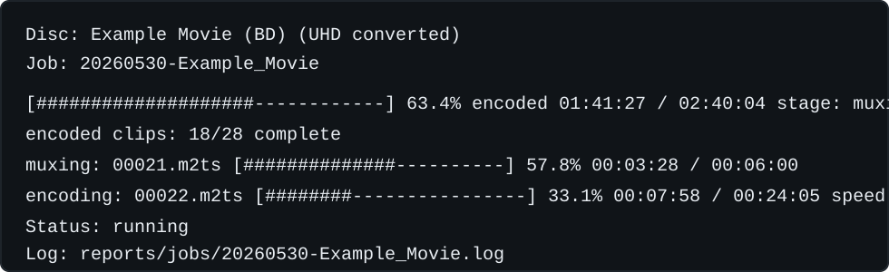

# BD2HEVC

BD2HEVC converts local, unencrypted Blu-ray folder backups to HEVC while keeping
the full-disc experience: menus, extras, playlists, BD-J files, audio, subtitles,
chapters, and navigation metadata.

The goal is a smaller backup that still behaves like the original disc in
VLC/libbluray. BD2HEVC does not decrypt discs, does not include keys, and does
not upscale video. The normal full-disc workflow keeps 1080p sources at 1080p
and reencodes non-HEVC video clips longer than 10 seconds to 8-bit HEVC Main.

License: GPL-3.0-only.

Supported platforms: Windows and Linux. WSL is supported for Linux-side
conversion when native Linux `ffmpeg`, `ffprobe`, and `tsmuxer` are installed on
the WSL `PATH`.

BD2HEVC is a reencoding and preservation tool for backups you already have. It
does not decrypt discs, bypass copy protection, provide keys, download media, or
include copyrighted disc assets.

Project status: alpha. The current structure is ready for initial public
testing, with low-level encoding, muxing, navigation metadata, BD-J
compatibility, queueing, validation, and repair code split into focused modules.
Disc compatibility should still be treated as community-tested rather than
guaranteed.

## Table Of Contents

- [Scope At A Glance](#scope-at-a-glance)
- [Quick Start](#quick-start)
- [Background Jobs](#background-jobs)
- [Quality And Audio Recipes](#quality-and-audio-recipes)
- [UHD And Disc Size Targets](#uhd-and-disc-size-targets)
- [Named Presets](#named-presets)
- [Clip And Quality Overrides](#clip-and-quality-overrides)
- [Optional Post-Processing](#optional-post-processing)
- [VLC Compatibility Fixes](#vlc-compatibility-fixes)
- [Normal Validation](#normal-validation)
- [Automated Support Reports](#automated-support-reports)
- [Interactive libbluray Recorder](#interactive-libbluray-recorder)
- [Requirements](#requirements)
- [Installing Tools](#installing-tools)
- [VLC Java Setup For Menus](#vlc-java-setup-for-menus)
- [What It Changes](#what-it-changes)
- [Bitrate Controls](#bitrate-controls)
- [Supported So Far](#supported-so-far)
- [Repair And Diagnostics](#repair-and-diagnostics)
- [JSON Output](#json-output)
- [Legal](#legal)

## Scope At A Glance

- Input: existing local `BDMV` folder backups that are already accessible to
  normal media tools.
- Output: a smaller full-disc folder backup with menus, extras, playlists,
  BD-J, chapters, subtitles, and navigation metadata preserved.
- Video: non-HEVC clips longer than 10 seconds are reencoded to HEVC/H.265; the
  default workflow keeps the source resolution and does not upscale. Optional
  deinterlacing can be enabled for interlaced source clips.
- Audio: passed through by default, with optional compact AC-3 stereo/mono for
  storage-limited collections.
- Not included: decryption, keys, ripping from protected discs, downloads, or
  copyrighted disc assets.

## Quick Start

Check that BD2HEVC can see the tools it needs:

```bash
python bd2hevc.py tools
```

Every command has built-in help with examples:

```bash
python bd2hevc.py --help
python bd2hevc.py queue --help
python bd2hevc.py diagnose --help
```

Convert in the foreground:

```bash
python bd2hevc.py auto "MY_DISC_BACKUP"
```

Convert to a specific collection folder:

```bash
python bd2hevc.py auto "MY_DISC_BACKUP" "Converted UHD-BD/My Disc (BD) (UHD converted)"
```

Preview what would be reencoded without writing an output:

```bash
python bd2hevc.py auto "MY_DISC_BACKUP" --dry-run
```

List clip ids, durations, source codecs, planned output codecs, and the quality
BD2HEVC would use:

```bash
python bd2hevc.py clips "MY_DISC_BACKUP"
python bd2hevc.py clips "MY_DISC_BACKUP" --deinterlace auto
```

The foreground command prints progress automatically and ends with a short
summary such as the output path, number of clips reencoded, and validation
status. Use `--report reports/name.json` when you want the full machine-readable
JSON report saved as well.

BD2HEVC targets HEVC/H.265 regardless of encoder. The tested default is
`--encoder hevc_nvenc`, and you can also select `hevc_qsv`, `hevc_amf`, or
`libx265` when your FFmpeg build supports them. If NVENC is unavailable, rerun
with an explicit alternative encoder, for example:

```bash
python bd2hevc.py auto "MY_DISC_BACKUP" --encoder libx265
python bd2hevc.py queue "BD backups" --output-dir "Converted UHD-BD" --encoder hevc_qsv
```

Full-disc conversion uses a small encode-to-mux queue for hardware HEVC
encoders: one clip encodes while the single muxer finishes earlier clips. When
`--audio-mode compact-stereo` is also enabled, compact audio gets its own
independent lane. The video lane and audio lane advance separately, and a clip
enters the single mux lane as soon as that clip's video and audio outputs are
both ready. CPU `libx265` stays serial. Use `--no-encode-ahead` to disable that
pipeline even with hardware encoding, or `--encode-ahead-depth 1` to allow only
one completed output per lane to wait for later stages.

## Background Jobs

For long conversions, use `start`. It creates the dry-run plan, queues the real
conversion in the background, and prints the exact status commands to use.
Background jobs run one at a time so multiple conversions do not fight over the
same encoder, disk I/O, or validation tools.

```bash
python bd2hevc.py start "MY_DISC_BACKUP" "Converted UHD-BD/My Disc (BD) (UHD converted)"
```

Check the newest job:

```bash
python bd2hevc.py status
```

`status` reports duration-weighted encoding progress, so a long movie clip
counts by how far that clip has encoded rather than only as "one clip not
done." Muxing and optional compact audio conversion appear as separate live
lines because they are required follow-up work, but they do not make the top
progress bar fall backward after a large clip finishes encoding.

Watch the whole queue until all currently running or queued jobs finish:

```bash
python bd2hevc.py status --watch
```

Watch a specific job until it finishes:

```bash
python bd2hevc.py status 20260429-153012-MY_DISC_BACKUP --watch
```

In an interactive terminal, `--watch` redraws the same status block in place
instead of appending a new progress bar every refresh. With no number it refreshes
once per second. Add a number to choose another interval, for example
`--watch 10`.



List recent jobs:

```bash
python bd2hevc.py jobs
```

Useful job filters:

```bash
python bd2hevc.py jobs --active
python bd2hevc.py jobs --failed
python bd2hevc.py jobs --failed --hide-old-failed
python bd2hevc.py jobs --completed --limit 30
```

Pause the queue after the current running conversion:

```bash
python bd2hevc.py pause-queue
```

Resume queued jobs:

```bash
python bd2hevc.py resume-queue
```

Cancel or remove a queued job:

```bash
python bd2hevc.py cancel 20260429-153012-MY_DISC_BACKUP
python bd2hevc.py remove 20260429-153012-MY_DISC_BACKUP
```

Stopping an already-running conversion is intentionally explicit:

```bash
python bd2hevc.py cancel 20260429-153012-MY_DISC_BACKUP --kill
```

Queue several conversions in one command:

```bash
python bd2hevc.py queue "Disc 1" "Disc 2" "Disc 3" --output-dir "Converted UHD-BD"
```

You can also point `queue` at a parent folder containing multiple BDMV backup
folders:

```bash
python bd2hevc.py queue "BD backups" --output-dir "Converted UHD-BD"
```

Job files, logs, plans, and full reports are written under `reports/jobs/`.
The final converted disc is written to the output folder shown by `start` or
`queue`.

## Quality And Audio Recipes

Use compact CQ for episode-heavy discs or very large movie discs:

```bash
python bd2hevc.py queue "Anime Disc 1" "Anime Disc 2" --output-dir "Converted UHD-BD" --quality cq:20
```

`--quality` is the general video policy for clips that BD2HEVC would normally
reencode. It accepts bitrate presets (`smaller`, `balanced`, `transparent`,
`source-ratio`, `compact-cq`), explicit source ratios (`source-ratio:0.62`,
`ratio:0.62`, or `0.62x`), CQ values (`cq:18`, `cq:20`), legacy preset names
(`episode-compact`, `anime-cq18`), or `copy`/`no-reencode`.

If a disc mixes codecs, the general source ratio can be combined with
codec-specific ratios:

```bash
python bd2hevc.py queue "Mixed Codec Disc" --output-dir "Converted UHD-BD" --quality source-ratio:0.60 --codec-source-ratio h264=0.55 --codec-source-ratio mpeg2video=0.30 --codec-source-ratio vc1=0.45
```

The codec-specific ratio wins only for matching source clips. Other clips keep
the general ratio or preset.

When accurate bitrate planning is used, BD2HEVC bases VBR presets on the actual
video packet payload rather than the whole M2TS container. For normal library
outputs it also subtracts safe coded padding where the codec exposes it:
AVC/H.264 filler NAL units, HEVC/H.265 filler NAL units, and VC-1 stuffing bytes.
This keeps authored-disc padding from making `balanced`, `smaller`, and
`transparent` spend bits on data that was not meaningful picture information.
Use `--keep-source-padding` to reproduce the previous padded-source estimate or
for conservative comparisons. `--uhd-profile disc` also keeps the padded-source
estimate because physical-disc sizing experiments should avoid optimistic
bitrate budgets.

For storage-limited movie collections, you can spend more bits on the main
feature while keeping extras compact:

```bash
python bd2hevc.py queue "Movie Disc" --output-dir "Converted UHD-BD" --quality cq:20 --main-title-quality cq:18
```

`--main-title-quality` applies only to the longest reencode-eligible clip, which
is the usual single-file main movie on many Blu-ray backups. Lower CQ means
larger and higher quality.

For episode discs, use `--top-n-quality COUNT QUALITY` instead. This applies the
chosen quality to the longest reencode-eligible clips, which lets a disc with
three episodes keep those episodes at higher quality while extras stay at the
general compact CQ:

```bash
python bd2hevc.py queue "Episode Disc" --output-dir "Converted UHD-BD" --quality cq:20 --top-n-quality 3 cq:18
```

`--top-n-quality` and `--main-title-quality` are mutually exclusive. The older
spellings `--bitrate-mode compact-cq --compact-cq-value 20`, `--main-title-cq
18`, and `--top-n-cq 3 18` still work.

## UHD And Disc Size Targets

Full-disc outputs always get the UHD-like folder normalization pass while
remaining unencrypted folder backups. BD2HEVC creates the expected BDMV and
CERTIFICATE folders when missing and mirrors required `BACKUP` files. In normal
library mode it keeps or restores Blu-ray `0200` style navigation headers
because that has been friendlier to VLC/libbluray on fragile BD-J discs. The
physical-disc profile can still patch copied navigation headers toward UHD-style
`0300` values. None of this is a claim that the result is a licensed/encrypted
UHD-BD.

`--uhd-profile` is reserved for intent and guardrails:

- `--uhd-profile library` is the default. It is for normal VLC/libbluray folder
  playback and still applies the UHD-like structure. Library mode subtracts safe
  coded source padding during accurate VBR planning.
- `--uhd-profile disc` is for physical-disc experiments. It requires
  `--target-disc-size` and rejects CQ/compact-CQ settings because CQ cannot know
  the final size before encoding. Disc mode keeps padded source bitrate
  estimates for conservative sizing and patches navigation version headers
  toward UHD-style `0300` values; it does not add fake codec filler back into
  the HEVC stream.

Patch an existing converted output without reencoding it:

```bash
python bd2hevc.py patch-uhd-profile "Converted UHD-BD/Movie Disc (BD) (UHD converted)"
```

For physical-disc experiments, use `--target-disc-size` with a VBR quality
choice. This scales planned video bitrates to fit the requested budget, leaving
a margin for filesystem and authoring overhead:

```bash
python bd2hevc.py auto "Disc" "Converted UHD-BD/Disc (BD) (UHD converted)" --uhd-profile disc --quality source-ratio:0.60 --target-disc-size bd25
python bd2hevc.py queue "BD backups" --output-dir "Converted UHD-BD" --uhd-profile disc --quality smaller --target-disc-size bd25 --target-disc-margin 0.96
```

Accepted sizes are `bd25`, `bd50`, `bd66`, `bd100`, or explicit sizes such as
`23.5GB`. Disc-size fitting requires VBR targets (`balanced`, `smaller`,
`transparent`, `source-ratio:N`, or the older bitrate-factor controls). It is
not used with CQ (`cq:18`, `cq:20`, `compact-cq`) because CQ does not know its
final size until after encoding.

If you burn the folder to optical media, the filesystem still matters. Use a
Blu-ray-capable authoring/burning tool that can write the correct UDF revision
for BD/UHD-BD media; BD2HEVC only prepares the folder tree and stream metadata.

## Named Presets

Use named presets when a profile is used repeatedly. Presets are stored in the
user config folder, so they can be loaded by name instead of by JSON path:

```bash
python bd2hevc.py preset save sarah --quality cq:20 --main-title-quality cq:18 --audio-mode compact-stereo
python bd2hevc.py queue "BD backups" --output-dir "Converted UHD-BD" --preset sarah
```

For mixed-codec source-ratio profiles:

```bash
python bd2hevc.py preset save source-mix --quality source-ratio:0.60 --codec-source-ratio h264=0.55 --codec-source-ratio mpeg2video=0.30 --codec-source-ratio vc1=0.45
python bd2hevc.py clips "BD backups\Movie Disc" --preset source-mix
python bd2hevc.py auto "BD backups\Movie Disc" --preset source-mix
```

For older extras-heavy discs with interlaced bonus clips:

```bash
python bd2hevc.py preset save old-extras --quality balanced --deinterlace auto
python bd2hevc.py queue "BD backups\Movie Disc" --output-dir "Converted UHD-BD" --preset old-extras
```

Manage presets with:

```bash
python bd2hevc.py preset list
python bd2hevc.py preset show source-mix
python bd2hevc.py preset remove source-mix
```

Command-line options still override preset values. For example, this uses the
saved preset but temporarily changes the MPEG-2 source ratio:

```bash
python bd2hevc.py auto "Disc" --preset source-mix --codec-source-ratio mpeg2video=0.28
```

## Clip And Quality Overrides

Quality selection is layered:

1. `--quality` chooses what happens to every clip that BD2HEVC would normally
   reencode.
2. A main-title or top-N override can retarget the longest clip or longest N
   clips.
3. Named clip overrides can handle odd cases discovered from `clips`, `scan`, or
   `--dry-run`.
4. `--copy-clips` wins last and leaves named clips untouched.

Preview clip ids and durations before choosing overrides:

```bash
python bd2hevc.py clips "Disc"
python bd2hevc.py clips "Disc" --quality cq:20 --top-n-quality 3 cq:18
```

Example output:

```text
BD2HEVC clips for Episode Disc
clip         duration action       source     field   output   src Mbps  quality
------------ -------- ------------ ---------- ------- -------- --------  ------------------------
00001.m2ts   00:24:02 reencode     h264       prog    hevc        18.7  cq:18 (compact-cq)
00002.m2ts   00:23:55 reencode     h264       prog    hevc        18.1  cq:18 (compact-cq)
00003.m2ts   00:02:14 copy         mpeg2video tt      mpeg2video   4.4  copy
00004.m2ts   00:00:07 copy         h264       prog    h264         2.1  copy
```

Use any quality for the main title:

```bash
python bd2hevc.py queue "Movie Disc" --output-dir "Converted UHD-BD" --quality smaller --main-title-quality transparent
python bd2hevc.py queue "Movie Disc" --output-dir "Converted UHD-BD" --quality smaller --main-title-quality source-ratio:0.62
```

Use any quality for the longest N clips:

```bash
python bd2hevc.py queue "Episode Disc" --output-dir "Converted UHD-BD" --quality smaller --top-n-quality 3 balanced
```

Use CQ as a selector-specific override:

```bash
python bd2hevc.py queue "Episode Disc" --output-dir "Converted UHD-BD" --quality cq:20 --top-n-quality 3 cq:18
python bd2hevc.py queue "Episode Disc" --output-dir "Converted UHD-BD" --quality anime-cq18 --top-n-quality 3 cq:18
```

Use copy/no-reencode as a quality choice. This example copies everything except
the three longest clips, which are reencoded at CQ 18:

```bash
python bd2hevc.py queue "Episode Disc" --output-dir "Converted UHD-BD" --quality copy --top-n-quality 3 cq:18
```

Target a specific clip by M2TS id. This is useful after `python bd2hevc.py clips
"Disc"` or `python bd2hevc.py auto "Disc" --dry-run` shows a clip that needs
different handling:

```bash
python bd2hevc.py auto "Disc" --clip-quality 00012 transparent
python bd2hevc.py auto "Disc" --clip-quality 00012 source-ratio:0.62
python bd2hevc.py auto "Disc" --clip-quality 00012 cq:20
python bd2hevc.py auto "Disc" --clip-quality 00012 copy
```

Exclude clips from reencoding when a menu/game/still-video clip behaves better
as the source stream:

```bash
python bd2hevc.py auto "Disc" --copy-clips 00012 00045
```

`--exclude-clips` is accepted as an alias for `--copy-clips`. Copied clips keep
their original codec and are not patched as HEVC, so use this only for clips you
intentionally want preserved exactly as they are in the source backup. Main-title
and top-N overrides are mutually exclusive with each other; named clip overrides
can be combined with either one.

If the playback setup is stereo, `--audio-mode compact-stereo` can save a lot of
space on discs with TrueHD/DTS-HD and many dub tracks:

```bash
python bd2hevc.py queue "Movie Disc" --output-dir "Converted UHD-BD" --quality cq:20 --main-title-quality cq:18 --audio-mode compact-stereo
```

This converts each audio track in reencoded clips to Blu-ray-friendly AC-3,
using stereo for multi-channel sources and mono for mono sources. PGS subtitles
are still preserved from the source clip. Defaults are `256k` for stereo and
`128k` for mono; adjust them with `--stereo-audio-bitrate` and
`--mono-audio-bitrate`. Audio passthrough remains the default.

## Optional Post-Processing

BD2HEVC preserves source pixels by default. Optional deinterlacing is available
for older extras, SD bonus material, and other clips that are visibly combed in
players:

```bash
python bd2hevc.py clips "Disc" --deinterlace auto
python bd2hevc.py queue "Disc" --output-dir "Converted UHD-BD" --deinterlace auto
```

`--deinterlace auto` uses FFprobe stream metadata such as `field_order=tt` or
`field_order=bb`; it does not try to guess from image content. This is
intentional. Pixel-analysis detectors can mistake progressive, telecined, or
noisy material for interlacing, and deinterlacing those clips can soften detail
or damage motion cadence. Auto mode is therefore opt-in and conservative.

The `clips` command shows the detected field order and marks planned clips with
`; deinterlace` when they will be filtered:

```text
BD2HEVC clips for The Matrix
clip         duration action       source     field   output   src Mbps  quality
------------ -------- ------------ ---------- ------- -------- --------  ------------------------
00043.m2ts   02:02:50 reencode     vc1        tt      hevc       4.359  2.0 Mbps (balanced); deinterlace
```

Deinterlacing is applied only to clips that are being reencoded. Copied clips
stay byte-for-byte source video. Use manual clip overrides when the metadata is
wrong or missing:

```bash
python bd2hevc.py queue "Disc" --output-dir "Converted UHD-BD" --deinterlace-clips 00043
python bd2hevc.py queue "Disc" --output-dir "Converted UHD-BD" --deinterlace auto --no-deinterlace-clips 00012
```

The default filter is `bwdif` in same-frame-rate mode so clip timing and
playlist progress stay aligned. `yadif` is available as a fallback:

```bash
python bd2hevc.py auto "Disc" --deinterlace auto --deinterlace-filter yadif
```

## VLC Compatibility Fixes

BD2HEVC defaults to `--vlc-compat auto`: it keeps the source disc structure, then
applies narrow known fixes for VLC/libbluray quirks when the converter can
recognize the affected BD-J bytecode.

For the closest possible copy of the source BD-J, disable those optional fixes:

```bash
python bd2hevc.py auto "Disc" "Converted UHD-BD/Disc (BD) (UHD converted)" --vlc-compat off
```

Apply compatibility fixes to an existing converted output:

```bash
python bd2hevc.py patch-vlc-compat "Converted UHD-BD/Disc (BD) (UHD converted)"
```

Built-in fixes can also be selected explicitly:

```bash
python bd2hevc.py auto "Disc" --vlc-fix topmenu-mark-zero-on-return
python bd2hevc.py auto "Disc" --vlc-fix music-jukebox-queued-state
```

For matching Warner-style music jukebox BD-J menus,
`music-jukebox-queued-state` closes the previous menu stack using the disc's
own menu transaction calls, keeps the authored jukebox popup and track group
together when extracted menu resources match, then queues the playlist-state
change so VLC/libbluray can render the track picker before switching playlists.
It also restores the authored default track focus when the queued state receives
input with no current button, avoiding a VLC/libbluray null-focus path while
leaving the disc's own playback helper in charge.

For matching BlueMoon-style BD-J menus, `topmenu-mark-zero-on-return` handles
discs where VLC/libbluray returns to a top-menu playlist at a positive playmark
and the disc app never redraws the menu overlay. It normalizes that top-menu
return to the menu entry point so normal mark events and BD-J graphics updates
fire again.

Advanced users can supply JSON patch files with `--compat-patch-file`. The
current custom format supports JAR entry patching with `replace_hex` and
`replace_method_call` operations, while preserving backups of edited JARs.

## Normal Validation

Validate an output against its source:

```bash
python bd2hevc.py validate "Converted UHD-BD/My Disc (BD) (UHD converted)" --reference "MY_DISC_BACKUP"
```

Skip MakeMKV if it is not installed or you only want FFprobe/decode checks:

```bash
python bd2hevc.py validate "Converted UHD-BD/My Disc (BD) (UHD converted)" --reference "MY_DISC_BACKUP" --no-makemkv
```

Save the full validation report:

```bash
python bd2hevc.py validate "Converted UHD-BD/My Disc (BD) (UHD converted)" --reference "MY_DISC_BACKUP" --report reports/my_disc.validate.json
```

## Automated Support Reports

If a converted backup has a menu, gallery, game, subtitle, audio, or playback
problem that you cannot reproduce on another machine, create a diagnostic bundle:

```bash
python bd2hevc.py diagnose "Converted UHD-BD/My Disc (BD) (UHD converted)" --source "MY_DISC_BACKUP"
```

The command writes a zip under `reports/diagnostics/` and prints the exact path.
Attach that zip to a GitHub issue along with a short description of the playback
steps that fail.

The diagnostic bundle is designed for public bug reports. It includes:

- BD2HEVC version, OS, Python, and discovered media tool versions.
- A file manifest with names, sizes, and timestamps.
- Redacted job metadata, plan, report, exit code, and a log tail when a matching
  background job is found. The default log tail is 5000 lines, and the bundle
  also includes a compact error-highlight file extracted from the full job log.
- A lightweight validation report run without MakeMKV so physical optical drives
  are not touched.

It intentionally does not include `.m2ts` media, BD-J JARs, keys, decryption
logs, or raw disc assets. Local absolute paths are replaced with placeholders.
If BD2HEVC cannot match the output to the correct job automatically, pass the job
id shown by `python bd2hevc.py jobs`:

```bash
python bd2hevc.py diagnose "Converted UHD-BD/My Disc (BD) (UHD converted)" --job 20260429-153012-MY_DISC
```

## Interactive libbluray Recorder

For failures that only happen after a specific VLC menu sequence, use the
interactive recorder. It opens VLC visibly with verbose libbluray logging, lets
you reproduce the failure, then packages the log and safe file manifests:

```bash
python bd2hevc.py record-libbluray "Converted UHD-BD/My Disc (BD) (UHD converted)" --source "MY_DISC_BACKUP" --label my-disc-gallery
```

Workflow:

1. Run the command.
2. VLC opens with disc menus enabled.
3. Reproduce the failure in VLC.
4. Return to the terminal and press Enter.
5. Attach the zip saved under `reports/libbluray-recordings/` to the issue and
   include the exact button sequence.

Useful options:

```bash
python bd2hevc.py record-libbluray "Converted UHD-BD/My Disc (BD) (UHD converted)" --region A
python bd2hevc.py record-libbluray "Converted UHD-BD/My Disc (BD) (UHD converted)" --duration 120
python bd2hevc.py record-libbluray "Converted UHD-BD/My Disc (BD) (UHD converted)" --isolated-bdj-storage
python bd2hevc.py record-libbluray "Converted UHD-BD/My Disc (BD) (UHD converted)" --libbluray-debug-mask
python bd2hevc.py record-libbluray "Converted UHD-BD/My Disc (BD) (UHD converted)" --dry-run
```

Use `--isolated-bdj-storage` when a BD-J problem is intermittent or when you
are comparing an original backup against a converted output. It gives VLC a
fresh libbluray cache and persistent-storage root for that recording so stale
BD-J state is less likely to hide the failure or create a false one.

Use `--libbluray-debug-mask` when VLC's normal verbose log is not enough. With
no value it captures libbluray critical, BluRay, NAV, BD-J, stream, graphics,
decode, and JNI categories into a separate `logs/libbluray-debug.log` file in
the bundle. You can pass a custom mask such as `--libbluray-debug-mask 0x2140`
for a narrower direct libbluray log.

The recorder does not include `.m2ts` media, BD-J JAR contents, keys, decryption
logs, or raw disc assets. It is meant to capture VLC/libbluray state and log
context, not redistribute disc data.

## Requirements

Supported operating systems:

- Windows
- Linux, including WSL when native Linux media tools are installed

Required:

- Python 3.10+
- FFmpeg and FFprobe with at least one supported HEVC encoder:
  `hevc_nvenc`, `hevc_qsv`, `hevc_amf`, or `libx265`
- tsMuxer 2.7 or newer

Optional but recommended:

- NVIDIA GPU/driver capable of NVENC HEVC for the tested default encoder path
- MakeMKV CLI (`makemkvcon` or `makemkvcon64`) for optional title scanning and
  structural validation
- VLC for headless playback smoke tests

BD2HEVC expects already-decrypted, local `BDMV` folder backups. It does not
bypass copy protection.

By default, full-disc folder conversion does not call MakeMKV. This keeps BD2HEVC
from waking or probing physical optical drives while you are using MakeMKV or
another program to create a backup from a disc. Opt in when you specifically want
that extra title scan:

```bash
python bd2hevc.py auto "Disc" --makemkv
python bd2hevc.py validate "Converted UHD-BD/Disc (BD) (UHD converted)" --makemkv
```

## Installing Tools

Windows:

- FFmpeg can be installed with winget or another package manager.
- MakeMKV is auto-detected from common Windows install folders.
- tsMuxer is auto-detected from the bundled `tools\tsmuxer\` folder, the legacy
  `tools\tsmuxer-2.7.0\` folder, or `PATH`.
- VLC is auto-detected from common Windows install folders.

Linux:

- Put required tools `ffmpeg`, `ffprobe`, and `tsmuxer` or `tsMuxeR` on `PATH`.
  Put optional `makemkvcon` and `vlc` on `PATH` if you want MakeMKV validation
  or VLC smoke tests.
- BD2HEVC intentionally prefers native Linux tools on Linux/WSL and ignores
  Windows `.exe` tools that may appear through WSL interop.
- Make sure your FFmpeg build lists the encoder you plan to use:

```bash
ffmpeg -hide_banner -encoders | grep -E 'hevc_nvenc|hevc_qsv|hevc_amf|libx265'
```

## VLC Java Setup For Menus

BD2HEVC preserves BD-J menus, so VLC needs a Java runtime that libbluray can
load. Without Java, VLC may play the main video but skip or break interactive
menus.

Windows:

- Install 64-bit VLC.
- Install a 64-bit Java runtime. Java 8 is the safest choice for BD-J menus;
  a 64-bit OpenJDK or JDK build is fine.
- Set `JAVA_HOME` to the Java install folder, for example
  `C:\Program Files\Eclipse Adoptium\jdk-8...`.
- Add both `%JAVA_HOME%\bin` and, when present, `%JAVA_HOME%\bin\server` to the
  user or system `PATH`.
- Restart VLC after changing environment variables.

Check Java from a new terminal:

```cmd
java -version
where java
```

Open a backup in VLC through BD2HEVC's clean launcher:

```cmd
python bd2hevc.py play "Converted UHD-BD\My Disc (BD) (UHD converted)" --region A
```

`play` starts a fresh VLC Blu-ray-menu session, disables VLC's resume prompt,
and avoids reusing an existing VLC playlist/input. That is more reliable for
some slow or stateful BD-J menus than opening the same folder manually.

Manual VLC opening is still possible:

1. Choose `Media` > `Open Disc`.
2. Select `Blu-ray`.
3. Browse to the backup folder that contains `BDMV`.
4. Leave `No disc menus` unchecked.
5. Press `Play`.

Linux:

- Install VLC, Java, and the BD-J support package for your distribution. On
  Debian/Ubuntu-style systems this is usually:

```bash
sudo apt install vlc openjdk-8-jre libbluray-bdj libbluray-bin
```

- If Java 8 is unavailable, use the distro's default JRE, but BD-J menu
  compatibility can vary by VLC/libbluray build.
- If multiple Java versions are installed, set `JAVA_HOME` before launching VLC:

```bash
export JAVA_HOME=/usr/lib/jvm/java-8-openjdk-amd64
export PATH="$JAVA_HOME/bin:$PATH"
python bd2hevc.py play "/path/to/backup" --region A
```

Troubleshooting:

- Match VLC and Java architecture on Windows: 64-bit VLC needs 64-bit Java.
- Open `Tools` > `Messages`, set verbosity to `2`, and look for `libbluray`
  messages if menus do not load.
- If a menu hangs only when opened manually, try `python bd2hevc.py play ...`.
  It launches VLC with `--bluray-menu`, `--qt-continue=0`,
  `--no-one-instance`, and `--no-playlist-enqueue`.
- Some VLC builds are packaged without BD-J support. Try the official VLC build
  on Windows or install your distro's `libbluray-bdj` package on Linux.
- WSL is useful for conversion, but native Windows or native Linux VLC is usually
  the better place to test BD-J menu playback.

References:

- VideoLAN libbluray: <https://images.videolan.org/developers/libbluray.html>
- VLC user documentation: <https://vlc-user-documentation.readthedocs.io/>

Optional editable install:

```bash
python -m pip install -e .
bd2hevc tools
```

## What It Changes

- Copies the full source backup structure.
- Reencodes non-HEVC video clips longer than 10 seconds to HEVC.
- Passes audio and PGS subtitle streams through unchanged by default.
- Optionally converts audio in reencoded clips to compact AC-3 stereo/mono with
  `--audio-mode compact-stereo`.
- Keeps source resolution. No upscaling is done by `auto`.
- Patches CLPI/MPLS video descriptors so replacement clips are described as
  HEVC.
- Adjusts CLPI packet maps so VLC/libbluray does not follow stale packet
  positions from the larger source streams. Short repeated-playitem menu and
  gallery clips use actual output keyframe packet positions instead of a simple
  source/output size ratio.
- Applies the always-on UHD-like structure pass: required folder placeholders
  and backup mirrors are created. Library mode keeps BD-style navigation version
  headers for VLC compatibility; disc mode can patch those headers toward UHD.
- Generates missing disc-library metadata so VLC shows a normal title instead
  of a long `bluray:///...` path.
- Applies known narrow BD-J compatibility fixes where BD2HEVC has an automated,
  disc-specific safe patch and `--vlc-compat` is enabled.

## Bitrate Controls

The default `balanced` mode estimates the HEVC target from the source video-only
bitrate, resolution, frame rate, and source codec. Audio bitrate is ignored so
passthrough audio does not inflate the video target. The AVC/H.264 curve is
anchored around the common HEVC "same quality at roughly half the bitrate"
target, then keeps a safety margin for one-pass hardware encoding and Blu-ray
folder playback.

For normal library conversions, accurate bitrate planning also subtracts safe
coded padding from the source video packet total: AVC/H.264 filler NAL units,
HEVC/H.265 filler NAL units, and VC-1 stuffing bytes. That keeps Blu-ray padding
from making `balanced`, `smaller`, `transparent`, and `source-ratio` spend bits
on data that was only there to satisfy the authored disc's rate-control/transport
constraints. `--keep-source-padding` keeps the previous padded-source estimate
for comparisons, and `--uhd-profile disc` keeps the padded total for more
conservative physical-disc experiments.

For clips that use different source codecs, `balanced`, `smaller`, and
`transparent` all start from the same source-equivalent curve and then apply a
codec adjustment:

- AVC/H.264 uses the base curve.
- MPEG-2 uses a lower HEVC/source factor because MPEG-2 is less efficient than
  AVC at the same visual quality.
- VC-1 uses an intermediate adjustment between AVC and MPEG-2.

MPEG-2 sources also get bitrate-sanity handling. When FFprobe reports a Blu-ray
MPEG-2 CPB ceiling instead of the actual clip bitrate, BD2HEVC falls back to the
container bitrate minus known audio. The 10-second rule still applies: MPEG-2
clips at or below 10 seconds are copied. `source-ratio` and
`source-ratio:0.62` intentionally use a fixed source-video multiplier, while
`cq:N` uses CQ rate control instead of the bitrate curve.

For source-ratio workflows, a general multiplier can be paired with
codec-specific overrides. This is useful because an AVC/H.264 source, an MPEG-2
source, and a VC-1 source usually should not all receive the same HEVC/source
factor:

```bash
python bd2hevc.py auto "Disc" --quality source-ratio:0.60 --codec-source-ratio h264=0.55 --codec-source-ratio mpeg2video=0.30 --codec-source-ratio vc1=0.45
```

Accepted codec aliases include `h264`, `avc`, `H.264`, `mpeg2`,
`mpeg2video`, `vc1`, `VC-1`, and `wmv3`.

When using VBR presets, `--target-disc-size` can apply one more scaling pass to
the selected reencoded clips so the estimated full-disc output fits a physical
disc budget:

```bash
python bd2hevc.py auto "Disc" --uhd-profile disc --quality source-ratio:0.60 --target-disc-size bd25
```

This is a planning estimate, not a burning guarantee. It accounts for copied
files, planned replacement video, passthrough or compact audio, and a safety
margin. CQ modes are intentionally rejected for this option because their output
size is discovered only after the encode finishes.

Presets:

```bash
python bd2hevc.py auto "Disc" --quality smaller
python bd2hevc.py auto "Disc" --quality balanced
python bd2hevc.py auto "Disc" --quality transparent
python bd2hevc.py auto "Disc" --quality source-ratio
python bd2hevc.py auto "Disc" --quality source-ratio:0.62
python bd2hevc.py auto "Disc" --quality cq:20
python bd2hevc.py auto "Disc" --quality episode-compact
python bd2hevc.py auto "Disc" --quality anime-cq18
```

The older bitrate flags are still available and are what preset JSON files use:

```bash
python bd2hevc.py auto "Disc" --bitrate-mode smaller
python bd2hevc.py auto "Disc" --bitrate-mode balanced
python bd2hevc.py auto "Disc" --bitrate-mode transparent
python bd2hevc.py auto "Disc" --bitrate-mode source-ratio
python bd2hevc.py auto "Disc" --bitrate-mode compact-cq
```

`compact-cq` is intended for space-focused conversions where CQ 18 is preferred
over the source-equivalent bitrate curve. It is useful for multi-episode/anime
discs and can also make high-bitrate movie discs substantially smaller than the
balanced preset.
By default, every clip above BD2HEVC's 10-second reencode threshold uses HEVC
CQ 18. With `hevc_nvenc`, CQ clips use a lean HandBrake-like CQ command path
instead of BD2HEVC's normal AQ/VBV-heavy movie tuning. It also avoids FFmpeg's
`-bluray-compat` shortcut for those CQ clips because that option can raise
bitrates at the same CQ value; BD2HEVC still keeps explicit AUD/GOP/metadata
controls for authored disc playback. `compact-cq` currently supports
`hevc_nvenc`, `hevc_amf`, and `libx265`; use `balanced`, `smaller`, or another
bitrate mode with `hevc_qsv`. The CQ cutoff can be raised if you only want
episode/movie-length clips to use CQ:

```bash
python bd2hevc.py auto "Disc" --bitrate-mode compact-cq --compact-cq-min-duration 20m
```

The CQ value can be adjusted too. Higher CQ values are smaller/lower quality;
lower CQ values are larger/higher quality:

```bash
python bd2hevc.py auto "Disc" --quality cq:20
python bd2hevc.py auto "Disc" --bitrate-mode compact-cq --compact-cq-value 20
```

For anime encodes similar to HandBrake's H.265 10-bit option, add:

```bash
python bd2hevc.py auto "Disc" --quality cq:20 --hevc-bit-depth 10
```

For most repeated workflows, named presets are easier than file paths:

```bash
python bd2hevc.py preset save source-mix --quality source-ratio:0.60 --codec-source-ratio h264=0.55 --codec-source-ratio mpeg2video=0.30
python bd2hevc.py auto "Disc" --preset source-mix
```

Preset JSON files are still supported when you want a version-controlled file:

```json
{
  "mode": "source-ratio",
  "factor": 0.60,
  "codec_source_ratios": {
    "h264": 0.55,
    "mpeg2video": 0.30,
    "vc1": 0.45
  },
  "max_video_bitrate": "70M"
}
```

Use it like this:

```bash
python bd2hevc.py auto "Disc" --preset-file examples/bitrate/source-ratio-by-codec.json
```

Preset files can set `mode`, `hevc_bitrate_factor` or `factor`,
`min_video_bitrate`, `max_video_bitrate`, `maxrate_multiplier`,
`bufsize_multiplier`, `keep_source_padding`, `compact_cq_value`,
`compact_cq_min_duration`, `codec_source_ratios`, `deinterlace`,
`deinterlace_filter`, `deinterlace_clips`, and `no_deinterlace_clips`.
Non-default CLI flags still work for one-off overrides. For example, a preset
can hold the normal source ratios while a command line can temporarily add or
replace one codec ratio with `--codec-source-ratio mpeg2video=0.28`.
`--bitrate-preset-file` is the full spelling; `--preset-file` is the short
alias.

Manual controls:

```bash
python bd2hevc.py auto "Disc" --hevc-bitrate-factor 0.62
python bd2hevc.py auto "Disc" --quality source-ratio:0.62
python bd2hevc.py auto "Disc" --quality source-ratio:0.60 --codec-source-ratio mpeg2video=0.30
python bd2hevc.py auto "Disc" --min-video-bitrate 2500k --max-video-bitrate 60M
python bd2hevc.py auto "Disc" --maxrate-multiplier 1.5 --bufsize-multiplier 2.0
python bd2hevc.py auto "Disc" --quality balanced --keep-source-padding --dry-run
```

## Supported So Far

These are observations from local testing, not a formal compatibility guarantee.
At the time of writing, every locally converted backup available for spot checks
has worked in VLC/libbluray, but future discs may still expose new BD-J or player
edge cases. The list below describes coverage shape, not a promise that every
edition or region behaves identically.

| Coverage area | Locally tried examples | Notes |
| --- | --- | --- |
| Movie discs | Dune, Dune Part Two, Groundhog Day, The Princess Bride, Ferris Bueller's Day Off, Interstellar, Tenet, The Truman Show, Walter Mitty, Goodbye Mr. Chips | Main playback, menu return, and extras workflows have been spot checked in VLC. |
| Bonus and non-feature discs | Interstellar bonus disc, Back to the Future bonus disc | Handles discs without an obvious single main title. |
| Episode and compact CQ discs | One Punch Man, Baccano!, Tensura/Re:Zero-style episode discs, BBC Pride and Prejudice | Covers multi-episode layouts, `compact-cq`, `--quality cq:N`, and `--top-n-quality` workflows. |
| Interactive BD-J extras | Speed, The Truman Show galleries, game-containing discs | Covers BD-J games, galleries, and menu timing repairs after CLPI/navigation fixes. |
| Optional validation helpers | MakeMKV title scanning, VLC smoke logs, diagnostic bundles | Useful for catching structure/player issues without sharing disc assets. |

Well-supported in current testing:

- Full-disc BD-J menu backups with the original menus and extras preserved.
- AVC/H.264 video reencoded to 8-bit HEVC Main with audio/subtitles passed
  through.
- MPEG-2 menu/gallery clips selected by the 10-second rule, including sparse
  still-like clips.
- VLC/libbluray folder playback on Windows with D3D11 hardware decoding.
- Discs with BD-J games or interactive extras, based on successful testing with
  a game-containing disc after the CLPI/menu timing fixes.
- MakeMKV title scanning as an optional structural validation layer.

Known limits and watch areas:

- BD2HEVC is not certified UHD-BD authoring software. The output is aimed at
  local folder playback in VLC/libbluray-style players. The always-on structure
  pass makes the folder tree and navigation headers more UHD-like, but it is
  still not a licensed/encrypted UHD-BD authoring pipeline.
- `--target-disc-size bd25` can make an estimated BD-25-sized output when VBR
  quality settings are used, but physical-player playback also depends on the
  burn, filesystem, player tolerance, and media.
- Every BD-J disc can do unusual things. If a menu, gallery, or game behaves
  oddly, keep the source and output and run validation/probes before deleting
  anything.
- `topmenu-mark-zero-on-return` was validated against a disc with a VLC-only
  top-menu redraw failure and is applied only when the matching BD-J wrapper
  signature is detected.
- VLC can log `buffer deadlock prevented`, `blurayReleaseVout`, or
  `SetThumbNailClip failed` during BD-J menu/gallery switching even when the
  output remains usable. D3D11 allocation failures are more suspicious and
  should be reported with logs.
- Main10 output is available, but the tested VLC path has been more reliable
  with the default 8-bit Main output for 8-bit BD sources.

## Repair And Diagnostics

Repair an older output with current converter rules:

```bash
python bd2hevc.py repair-output "MY_DISC_BACKUP" "Converted UHD-BD/My Disc (BD) (UHD converted)"
```

Preview the repair plan:

```bash
python bd2hevc.py repair-output "MY_DISC_BACKUP" "Converted UHD-BD/My Disc (BD) (UHD converted)" --dry-run
```

Apply only the UHD profile folder pass to older outputs, restoring BD-style
headers for VLC/library playback:

```bash
python bd2hevc.py patch-uhd-profile "Converted UHD-BD/My Disc (BD) (UHD converted)"
```

Patch headers toward UHD-style values for a physical-disc experiment:

```bash
python bd2hevc.py patch-uhd-profile "Converted UHD-BD/My Disc (BD) (UHD converted)" --uhd-profile disc
```

Run a headless VLC/libbluray smoke test without opening a visible video window:

```bash
python bd2hevc.py vlc-smoke "Converted UHD-BD/My Disc (BD) (UHD converted)"
```

Open a backup in VLC with a clean BD-J menu launch:

```bash
python bd2hevc.py play "Converted UHD-BD/My Disc (BD) (UHD converted)" --region A
```

Test the Windows D3D11 path:

```bash
python bd2hevc.py vlc-smoke "Converted UHD-BD/My Disc (BD) (UHD converted)" --video-plane --d3d11
```

Isolate libbluray's BD-J cache and persistent storage for an intermittent menu
startup check:

```bash
python bd2hevc.py vlc-smoke "Converted UHD-BD/My Disc (BD) (UHD converted)" --video-plane --isolated-bdj-storage
```

Probe a specific playlist through libbluray/FFprobe:

```bash
python bd2hevc.py playlist-probe "Converted UHD-BD/My Disc (BD) (UHD converted)" --playlist 23 --reference "MY_DISC_BACKUP" --decode-seconds 24
```

Patch missing disc metadata on existing outputs:

```bash
python bd2hevc.py patch-disc-metadata "Converted UHD-BD"
```

Create a redacted bundle for a GitHub support issue:

```bash
python bd2hevc.py diagnose "Converted UHD-BD/My Disc (BD) (UHD converted)" --source "MY_DISC_BACKUP"
```

Record an interactive VLC/libbluray reproduction session:

```bash
python bd2hevc.py record-libbluray "Converted UHD-BD/My Disc (BD) (UHD converted)" --source "MY_DISC_BACKUP" --label my-disc-gallery
```

Audit source backups for transport null packets and safe coded-video padding:

```bash
python scripts/source_padding_audit.py "BD backups" --report reports/source-padding-audit.json --progress reports/source-padding-audit.progress.json
```

The audit is read-only. It is mainly useful when you want to know whether a
source disc has codec filler that can inflate source-ratio or `balanced` VBR
planning. The report separates mux-layer null packets from coded-video padding,
and lists the clip files that contain H.264 filler, HEVC filler, or VC-1
stuffing bytes.

## JSON Output

Normal commands print human summaries. Use these when you want detailed reports:

```bash
python bd2hevc.py auto "Disc" --report reports/disc.convert.json
python bd2hevc.py auto "Disc" --json
python bd2hevc.py validate "Output" --reference "Disc" --report reports/disc.validate.json
python bd2hevc.py tools --json
```

## Legal

Use BD2HEVC only with backups you are legally allowed to process. The project
does not include or provide decryption, keys, disc data, BD-J source code, or
copyrighted assets.
