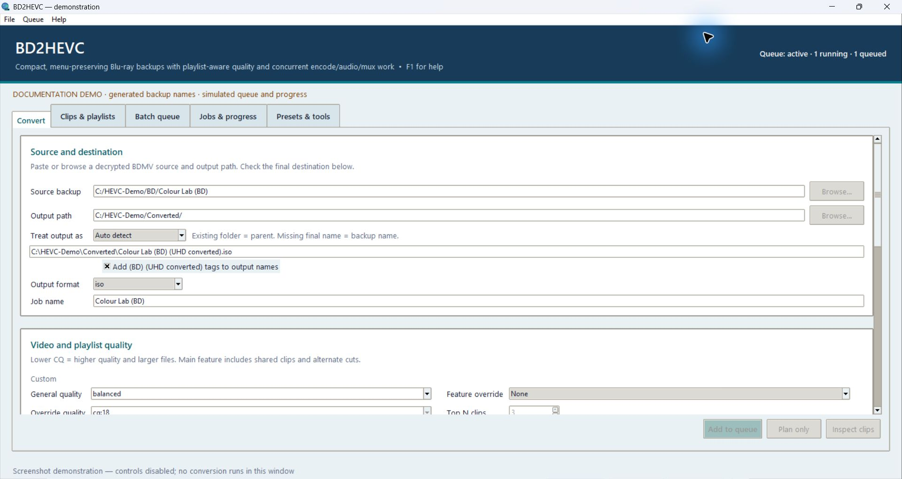
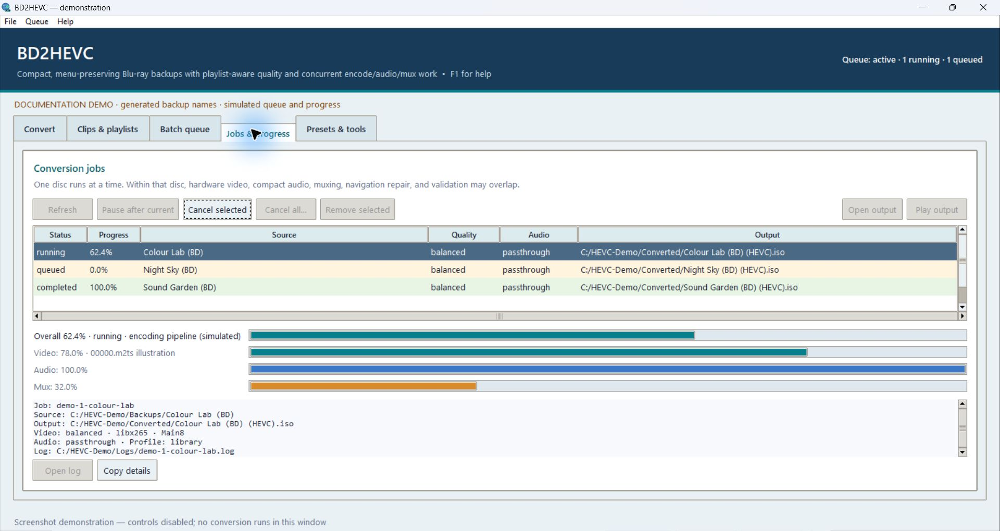

# BD2HEVC

**Smaller Blu-ray backups, with the disc experience kept together.** BD2HEVC reencodes video to HEVC/H.265 while preserving the backup's menus, extras, playlists, chapters, audio and subtitles. Choose a folder or ISO output, convert one disc, or leave a batch queue working in the background.

This is the **0.2.0a2 alpha update**, with a full Windows GUI: conversion planning, presets, folder/ISO output, batch queues, watched folders, progress and diagnostics. The earlier public announcement covered the command-line version. Windows is the main desktop platform. The normal workflow keeps the original resolution and colour information: a 1080p Blu-ray stays 1080p. The older “UHD converted” filename tag describes HEVC conversion; it does not mean upscaling, HDR creation or guaranteed UHD player compatibility.

Source and alpha downloads: [BD2HEVC on GitHub](https://github.com/nathanturk2/BD2HEVC).



*The real Windows interface, showing a copyright-free example. Documentation demo windows are labelled; queue states and percentages in the screenshots are simulated. The generated conversion results below come from actual runs.*

## Table of contents

- [What you need](#what-you-need)
- [Install and open the app](#install-and-open-the-app)
- [Convert your first backup](#convert-your-first-backup)
- [Choose quality and audio](#choose-quality-and-audio)
- [Queues and watched folders](#queues-and-watched-folders)
- [A generated example](#a-generated-example)
- [Tested Blu-rays](#tested-blu-rays)
- [Check and play the result](#check-and-play-the-result)
- [Troubleshooting and support](#troubleshooting-and-support)
- [Command line and further reading](#command-line-and-further-reading)
- [Contributing and licence](#contributing-and-licence)

## What you need

Start with an **already-decrypted Blu-ray backup folder** containing `BDMV/STREAM`. BD2HEVC does not decrypt discs. Extract or mount an ISO and copy its backup folder first.

| Requirement | Purpose |
| --- | --- |
| Windows 10/11, Python 3.10 or newer with Tkinter | Desktop app and conversion coordinator |
| FFmpeg and FFprobe on `PATH` | Encode, inspect and decode video |
| tsMuxeR with HEVC support | Rebuild Blu-ray transport streams |
| A working HEVC encoder | NVIDIA NVENC is the usual default; Intel QSV, AMD AMF and software x265 are selectable |
| Free space for the converted backup and temporary work | ISO output also needs its staging folder until verification finishes |
| VLC with libbluray; Java for BD-J menus where needed | Play the full disc, including supported menus |
| MakeMKV CLI, optional | Additional title-level inspection and validation |

The Windows x64 release includes the Hadris UDF author and its fork source for ISO output. Other platforms need a compatible author built from that source or supplied through `BD2HEVC_UDF_TOOL`. FFmpeg, tsMuxeR, VLC and MakeMKV are installed separately. See [third-party notices](THIRD_PARTY_NOTICES.md).

## Install and open the app

Download and extract the release source archive into a permanent folder. Open PowerShell there and run:

```powershell
python -m pip install .
python bd2hevc.py tools
python bd2hevc.py gui
```

The tool check lists what was found. Install any missing programs before starting a conversion. An encoder listed by FFmpeg must also work with your actual GPU and drivers; conversion preflight checks this.

For a desktop shortcut, run:

```powershell
powershell -NoProfile -ExecutionPolicy Bypass -File tools\install-gui-shortcut.ps1
```

Keep the extracted folder in place. Reinstall the shortcut if you move it. You can also install the release wheel with `python -m pip install PATH_TO_WHEEL.whl` and run `bd2hevc gui`; its icons, naming data, author and documentation are packaged with it.

Jobs, reports and GUI state normally live under `%LOCALAPPDATA%\BD2HEVC`, rather than inside the installation. `BD2HEVC_STATE_DIR` selects a different state folder. Existing repository-local reports are copied on first use; a live legacy worker keeps its original report location until it finishes.

## Convert your first backup

1. Open **Convert**, then browse to the folder containing `BDMV`. Pasting the `BDMV` path also works.
2. Choose the destination. A destination folder gets an automatically named output; **Full output path** lets you choose its exact name. Check the final path preview.
3. Choose **folder** or **iso**. Keep the **library** profile for normal VLC playback.
4. Start with **balanced**, your working encoder, **8-bit**, automatic deinterlacing and **passthrough** audio.
5. Use **Plan only** to inspect the proposed work. **Clips & playlists** lets you see the main feature and adjust individual clips.
6. Choose **Add to queue**, then open **Jobs & progress**. One disc runs at a time; video, audio and mux work within that disc can overlap where supported.
7. Wait for completion, then play the output. Try the main menu, a chapter jump, an extra, and your preferred audio/subtitle tracks.

The source remains untouched. A replacement requested with `--force` is built separately and validated before replacing an existing output. Failed scans and missing or empty clip inventories stop the conversion. For important backups, keep the original until you have checked playback.



*The queue shows running, waiting and completed jobs. The separate bars explain which part of the pipeline is busy; the example percentages are illustrative.*

## Choose quality and audio

| Setting | When to use it |
| --- | --- |
| **balanced** | A sensible starting point for a full disc |
| **smaller** | More storage savings; check the result on demanding scenes |
| **transparent** | More bitrate for demanding material |
| **cq:N** | Quality-based encoding; lower numbers mean larger, higher-quality output |
| Main-feature / top-N / clip overrides | Spend more quality on the film or selected episodes |
| Audio **passthrough** | Preserve source audio tracks |
| Audio **compact-stereo** | Convert playable tracks to compact AC-3 stereo, retaining mono sources as mono |
| Deinterlace **auto** | Convert clips identified as interlaced; progressive clips keep their cadence |

Clips of ten seconds or less are normally copied. Overrides can copy longer clips or force encoding. Copy-only material still receives inventory/probe validation. HEVC is lossy; a smaller result cannot be assumed to preserve every visible detail.

The hardware paths depend on your FFmpeg build and drivers. Software `libx265` works without a supported GPU and usually takes longer. The release's generated example uses it; broad commercial-disc encoder coverage still centres on the maintainer's NVENC workflow.

## Queues and watched folders

**Batch queue** scans a folder and previews the backups before queuing them with the current settings. Review the destinations, then queue the selected discs or all shown discs.

A **watched batch** keeps checking an intake folder for new, stable backups. Use it after setting the conversion options. Pause stops new work from starting; cancel stops the selected active work. The GUI can close while background jobs continue.

The normal queue uses an exclusive cross-process work lock and coordinated job records. Two producers cannot admit competing conversions to the same queue slot or reserve the same active output. Job cancellation survives stale status writes.

## A generated example

The included demo makes **Colour Lab**, a 16-second moving test pattern with a generated tone. It creates a small AVC Blu-ray backup, then runs the ordinary full-disc conversion and ISO verification. No film footage is used.

```powershell
python tools\make-demo.py C:\HEVC-Demo\FreshBD --convert
```

Supply `--tsmuxer C:\Tools\tsMuxeR.exe` if discovery cannot find it. The destination must be new; this demo refuses to overwrite an existing directory.

| Actual run, 5 October 2026 | Result |
| --- | --- |
| Source video | 1280×720, 24 fps, AVC; stereo AC-3 |
| Output video | HEVC, software `libx265` |
| Source backup size | 11,104,248 bytes (10.59 MiB) |
| Output ISO size | 8,404,992 bytes (8.02 MiB) |
| Automated result | Passed stream/decode checks, UDF checks and file payload hashes |

This small synthetic disc demonstrates the workflow; it is not a movie-size savings benchmark or a test of commercial menus. The script writes the generated backup, output, logs and `demo-result.json` to your chosen demo folder. The recorded [result](docs/demo-result.json) ships with the source. For screenshot recreation, `python tools\demo-ui.py` opens an isolated, labelled interface with simulated jobs.

## Tested Blu-rays

The maintainer's **Celsus / Converted Backups** test collection contains **117 eligible converted Blu-ray images** in the 30 September 2026 snapshot. It covers films, TV/anime collections and separate bonus discs. Examples include:

| Group | Converted/test examples |
| --- | --- |
| Films | The Matrix, The Princess Bride, Inception, Interstellar, Tenet, Dune and Dune: Part Two |
| Series of films | Back to the Future I–III, John Wick 1–4, Avengers films, Iron Man, Captain America: Civil War |
| Other films | The Godfather, Groundhog Day, Speed, The Truman Show, Tron: Legacy, Tinker Tailor Soldier Spy |
| Television | Star Trek: The Next Generation, Pride and Prejudice (BBC) |
| Anime | Baccano!, Fullmetal Alchemist: Brotherhood, Frieren, March Comes in Like a Lion, One Punch Man, Re:Zero, Solo Leveling |
| Extras | Separate bonus discs for Back to the Future, Avengers: Endgame, Interstellar, Iron Man 3, Star Wars and Tenet |

See the [complete disc-by-disc collection](docs/TESTED_DISCS.md). **3D discs and native UHD discs are excluded** from these converted examples. Inventory presence establishes an existing converted/test example, not a new exhaustive playback test of every edition or every menu route. Results across this varied collection give useful confidence, while the project remains alpha.

## Check and play the result

Use **Play output** in the GUI, or:

```powershell
python bd2hevc.py play "F:\Converted\Movie.iso"
python bd2hevc.py validate "F:\Converted\Movie" --no-makemkv
python bd2hevc.py verify-iso "F:\Converted\Movie.iso" --manifest "F:\Converted\Movie.iso.sha256.json"
```

Folder validation checks streams and optional decode samples. ISO authoring compares every staged file's size and SHA-256 against its contained bytes before publishing, then writes a checksum sidecar. Keep that sidecar for later verification. `verify-iso` without a reference or manifest checks the filesystem structure only.

VLC/libbluray supports the normal digital-library workflow. Menus may need Java, region settings or a compatibility fix. Physical UHD players are a separate compatibility target: HEVC conversion alone does not establish disc compliance. See [technical notes](docs/TECHNICAL_NOTES.md) and [backup repair](docs/BACKUP_REPAIR.md).

## Troubleshooting and support

If the job fails, read **Jobs & progress** and its log first. Missing tools, incomplete backups, failed stream checks and unsupported encoder configurations should produce explicit errors. Correct the cause before retrying.

To prepare a support bundle:

```powershell
python bd2hevc.py diagnose "F:\Converted\Movie" --output "F:\Support\Movie-diagnostics.zip"
```

Bundles redact known private paths, including JSON-escaped Windows paths, and omit raw media. Review the bundle before sharing: paths and logs can still reveal disc titles or other context. Existing bundles need `--force`; media and protected workspaces remain protected even with that flag.

Report the exact error, source/output format, app version, encoder, tool versions and the navigation steps that fail. Do not attach disc images or copyrighted media. If an interrupted worker leaves stale history, inspect the entry and remove inactive history before starting a fresh job; completed backups are retained.

## Command line and further reading

```powershell
# Preview, then convert a full disc
python bd2hevc.py auto "D:\Backups\Movie" "F:\Converted\Movie.iso" --output-format iso --dry-run
python bd2hevc.py start "D:\Backups\Movie" "F:\Converted\Movie.iso" --output-format iso
python bd2hevc.py status --watch
python bd2hevc.py queue "D:\Backups" --output-dir "F:\Converted" --output-format iso
```

After installing the package, `bd2hevc` is also available as a command. Use `--help` or `COMMAND --help` for individual options.

- [Detailed workflow reference](docs/WORKFLOW_REFERENCE.md): clip overrides, bitrate and advanced examples.
- [Technical notes](docs/TECHNICAL_NOTES.md): preservation and playback behaviour.
- [Developer workflows](docs/DEVELOPER_WORKFLOWS.md): module ownership, legacy commands and synthetic checks.
- [Release preparation](docs/PUBLISHING.md): clean exports, installation checks and playback matrix.
- [Tool inventory](docs/TOOL_PROVENANCE.md): bundled sources, builds, licences and hashes.
- [Changelog](CHANGELOG.md): changes in this update.

## Contributing and licence

See [CONTRIBUTING.md](CONTRIBUTING.md). Small, reproducible examples are particularly useful for unusual menus, sparse-timing clips and track-preservation bugs. The source is **GPL-3.0-only**; third-party components retain their own licences as described in [THIRD_PARTY_NOTICES.md](THIRD_PARTY_NOTICES.md).

Release details and local validation: [RELEASE_NOTES.md](docs/RELEASE_NOTES.md).
